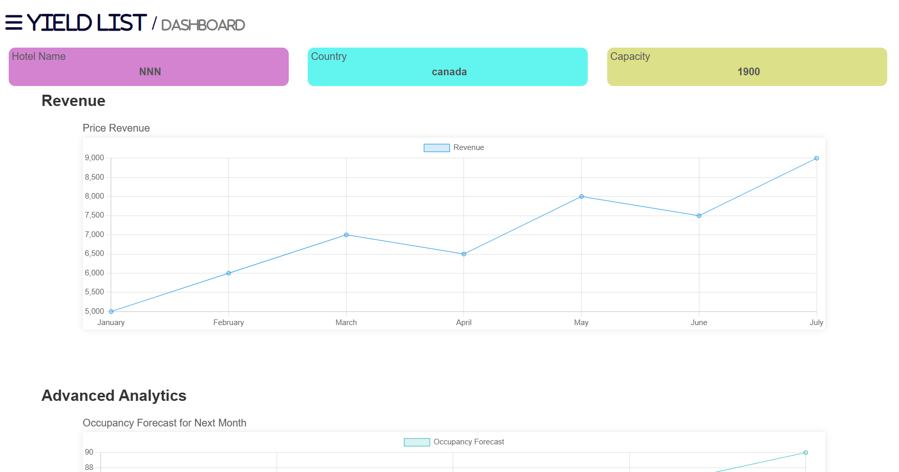

# PMS Hotel Yield Management

A **PMS** Yield/Revenue Management system for hotels built with Django.  
It helps operations and pricing teams make faster decisions based on market, occupancy, and forecast data.

## What This Project Provides for Hotels

- Monitor competitor and market prices through the **Market Place** page by city for upcoming days.
- Use a **Dashboard** view to track revenue indicators and operational improvement tips.
- Review **Main Yield** pricing, including final advised rates, override rates, and benchmark comparison.
- Manage pricing configuration from one place:
  strategies, thresholds, overrides, room-type rules, notes, budgets, and forecasts.
- Use supporting analysis pages such as:
  Forecasts, Top10, DOW YOY, Monthly Totals, Yield History, and Calendar.

## Framework and Stack

- **Backend:** Python + Django `5.0.3`
- **Database:** SQLite (`db.sqlite3`)
- **Frontend:** Django Templates + HTML/CSS/JavaScript
- **Libraries:** `requests`, `beautifulsoup4`, `schedule`, `amadeus`
- **External Integration:** Booking integration through RapidAPI in `yieldManagement/booKingApi.py`

## Core Database Entities

Main tables in the `yieldManagement` app:

- `Vendor`: Data provider (for example, booking.com).
- `MarketPlaceModel`: Competitor hotel records and 7-day check-in prices (`CheckIn0` to `CheckIn6`).
- `WeekDays`: Weekday labels used in marketplace display.
- `Strategies`: Yield strategy rules by month/day/sold levels.
- `ThreShold`: Minimum and maximum price boundaries plus sellout value.
- `OverRide`: Manual pricing overrides for specific date ranges.
- `RoomTypeYield`: Pricing configuration per room type.
- `BudgetYield` and `ForecastYield`: Budget and forecast occupancy inputs.
- `NoteYield`: Operational notes tied to date ranges.
- `CalenderYield`: Calendar events related to pricing periods.
- `ReportYield`: Report scheduling and delivery settings.

> Most settings tables are linked to users through `user_name` (ForeignKey to `django.contrib.auth.models.User`).

## Project Structure Image (Placeholder)


### login - SignIn:


# frontend:



## Run the Project

1. Create a virtual environment:
```powershell
python -m venv .venv
```

2. Activate it:
```powershell
.venv\Scripts\activate
```

3. Install dependencies:
```powershell
pip install -r requirements.txt
```

4. Apply migrations:
```powershell
python manage.py migrate
```

5. (Optional but recommended) Create an admin user:
```powershell
python manage.py createsuperuser
```

6. Start the server:
```powershell
python manage.py runserver
```

7. Open these URLs:
- Home: `http://127.0.0.1:8000/`
- Yield Dashboard: `http://127.0.0.1:8000/yield/dashboard`
- Yield Settings: `http://127.0.0.1:8000/yield/settings`
- Django Admin: `http://127.0.0.1:8000/admin/`

## Important Notes

- The **Market Place** feature depends on RapidAPI calls in `yieldManagement/booKingApi.py`.
- Ensure a `Vendor` entry with name `booking.com` exists so marketplace pricing retrieval works correctly.
- Move API keys from source code to environment variables before production deployment.
